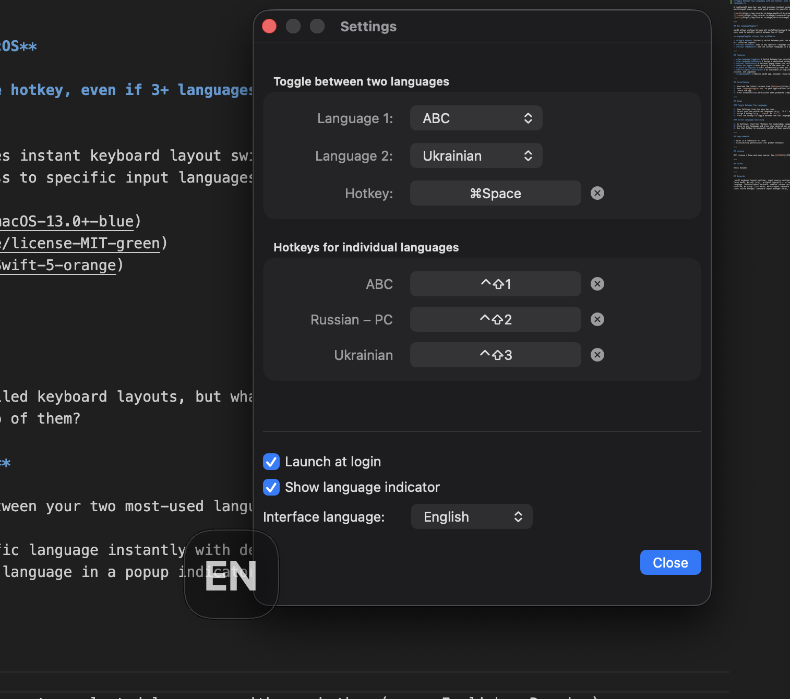

# LanguageToggler

**Fast keyboard layout switcher for macOS**

**Toggle between two languages with one hotkey, even if 3+ languages are installed, or assign hotkeys to specific languages.**

A lightweight menu bar app that provides instant keyboard layout switching with customizable hotkeys. Perfect for multilingual users who need quick access to specific input languages.

---

## Why LanguageToggler?

macOS allows cycling through all installed keyboard layouts, but what if you have 3, 4, or more languages installed and only need to quickly switch between two of them?

**LanguageToggler solves this problem:**

- **Toggle mode**: Instantly switch between your two most-used languages with a single hotkey — no more cycling through all installed layouts
- **Direct access**: Jump to any specific language instantly with dedicated hotkeys
- **Visual feedback**: See the current language in a popup indicator

---

## Features

- **Two-language toggle** — Switch between two selected languages with one hotkey (e.g., English ↔ Russian)
- **Per-language hotkeys** — Assign a dedicated hotkey to any installed keyboard layout for instant switching
- **Visual indicator** — Optional popup shows the current language after switching
- **Menu bar app** — Runs quietly in the menu bar, no Dock icon
- **Launch at login** — Start automatically when you log in
- **Multilingual interface** — UI available in English, Russian, Ukrainian, German, French, Spanish, Italian, Turkish, Chinese, and Japanese
- **Lightweight** — Native macOS app, minimal resource usage

---

## Installation

1. Download the latest release from [Releases](https://github.com/Denis-Davidoff/macos-language-toggler/releases)
2. Move `LanguageToggler.app` to your Applications folder
3. Launch the app
4. Grant Accessibility permissions when prompted (required for global hotkeys)

---

## Usage

### Toggle Between Two Languages

1. Open Settings from the menu bar icon
2. Select your two preferred languages (e.g., "U.S." and "Russian")
3. Assign a hotkey (e.g., `⌥Space` or `⌃⇧L`)
4. Press the hotkey to toggle between the two languages

### Direct Language Switching

1. In Settings, find the "Hotkeys for individual languages" section
2. Click on any language and press your desired key combination
3. Use that hotkey to instantly switch to that specific language

---

## Requirements

- macOS 13.0 (Ventura) or later
- Accessibility permissions (for global hotkeys)

---

## License

MIT License — Free and open source. See [LICENSE](LICENSE) for details.

---

## Author

Denis Davydov

---

## Keywords

_macOS keyboard layout switcher, input source switcher, language toggle, keyboard language hotkey, быстрое переключение языка macOS, переключатель раскладки клавиатуры, хоткей для смены языка, input method switcher, keyboard shortcut language, Tastaturlayout wechseln, cambiar idioma teclado mac, changer langue clavier mac, 键盘布局切换, キーボードレイアウト切り替え, перемикач мови macOS, multilingual keyboard switcher, two language toggle mac, direct language switch hotkey, input source manager, keyboard layout manager macOS_
